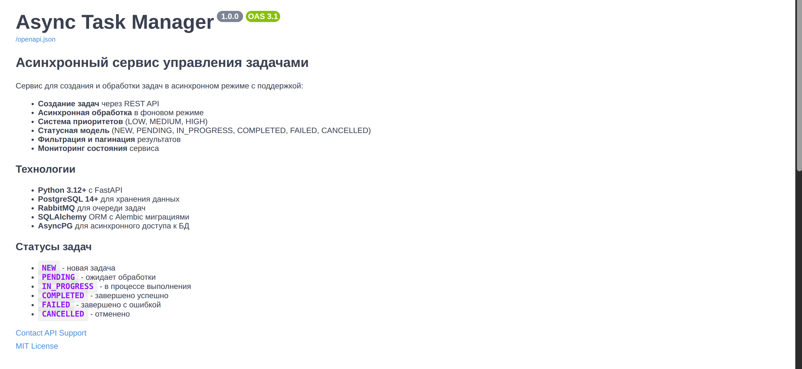

# async-task-manager

Асинхронный сервис управления задачами с RabbitMQ и PostgreSQL.



## Функциональность

- **REST API** для управления задачами (создание, получение, отмена)
- **RabbitMQ** для асинхронной обработки задач по приоритетам
- **Система приоритетов** - HIGH/MEDIUM/LOW с отдельными очередями
- **PostgreSQL** для хранения задач
- **Статусы задач** - NEW/PENDING/IN_PROGRESS/COMPLETED/FAILED/CANCELLED
- **Docker** для простого развертывания

## Быстрый старт

### 1. Настройка

1. Установите [uv](https://github.com/astral-sh/uv):

```bash
# На Linux/macOS через curl
curl -LsSf https://astral.sh/uv/install.sh | sh
# или через pipx
pipx install uv
```

2. Создайте виртуальное окружение и активируйте его:

```bash
uv venv
source .venv/bin/activate  # Linux/Mac
# или
.venv\Scripts\activate  # Windows
```

3. Установите зависимости проекта:

```bash
uv sync
```

### 2. Запуск всех сервисов
```bash

# Запуск всех сервисов (API + Worker + DB + RabbitMQ)
make up

# Применение миграций
make migrate
```

### 2. Проверка работы
```bash
# API доступно по адресу: http://localhost:8000
# Swagger UI: http://localhost:8000/docs
# RabbitMQ Management: http://localhost:15672 (guest/guest)

# Создание задачи
curl -X POST "http://localhost:8000/api/v1/tasks/" \
  -H "Content-Type: application/json" \
  -d '{
    "title": "Тестовая задача",
    "description": "Описание задачи",
    "priority": "HIGH"
  }'

# Получение списка задач
curl "http://localhost:8000/api/v1/tasks/"
```

## Архитектура

```
┌─────────────────┐    ┌─────────────────┐    ┌─────────────────┐
│                 │    │                 │    │                 │
│   FastAPI App   │────│    RabbitMQ     │────│  Task Worker    │
│    (REST API)   │    │   (3 Queues)    │    │   (Consumer)    │
│                 │    │                 │    │                 │
└─────────┬───────┘    └─────────────────┘    └─────────┬───────┘
          │                                             │
          │            ┌─────────────────┐              │
          └────────────│   PostgreSQL    │──────────────┘
                       │   (Database)    │
                       └─────────────────┘
```

## API Endpoints

### Создание задачи
```http
POST /api/v1/tasks/
Content-Type: application/json

{
  "title": "Название задачи",
  "description": "Описание задачи",
  "priority": "HIGH"  // HIGH, MEDIUM, LOW
}
```

### Получение списка задач
```http
GET /api/v1/tasks/?status=NEW&priority=HIGH&skip=0&limit=10
```

### Получение задачи по ID
```http
GET /api/v1/tasks/{task_id}
```

### Получение статуса задачи
```http
GET /api/v1/tasks/{task_id}/status
```

### Отмена задачи
```http
DELETE /api/v1/tasks/{task_id}
```

## Разработка

### Возможности приложения
```bash
# Запуск только базовых сервисов (DB + RabbitMQ)
make api-only

# Применение миграций
make migrate

# Запуск API в режиме разработки
make dev

# Запуск воркера (в отдельном терминале)
make worker
```

### Полезные команды
```bash
make help           # Показать все команды
make up             # Запустить все сервисы
make down           # Остановить все сервисы
make logs           # Показать логи
make test           # Запустить тесты
make lint           # Проверить код
make format         # Отформатировать код
```

### Переменные окружения
```bash
Посмотри в .env.template и добавь в свой .env
```

## Система приоритетов

Задачи обрабатываются в отдельных очередях по приоритетам:

- **HIGH** - высокий приоритет (2 секунды обработки)
- **MEDIUM** - средний приоритет (5 секунд обработки)  
- **LOW** - низкий приоритет (10 секунд обработки)

Воркер одновременно слушает все очереди, но обрабатывает задачи справедливо (prefetch_count=1).

## Статусы задач

- **NEW** - задача создана, но не отправлена в очередь
- **PENDING** - задача отправлена в RabbitMQ и ожидает обработки
- **IN_PROGRESS** - задача обрабатывается воркером
- **COMPLETED** - задача успешно выполнена
- **FAILED** - ошибка при выполнении задачи
- **CANCELLED** - задача отменена пользователем

## Мониторинг

- **RabbitMQ Management UI**: http://localhost:15672
- **API Documentation**: http://localhost:8000/docs
- **Health Check**: http://localhost:8000/health 

## Тестирование

```bash
# Запуск тестов
make test

# Запуск интеграционных тестов 
make test-integration

# Тестирование API
curl -X POST http://localhost:8000/api/v1/tasks/ \
  -H "Content-Type: application/json" \
  -d '{"title": "Test", "priority": "HIGH"}'
```